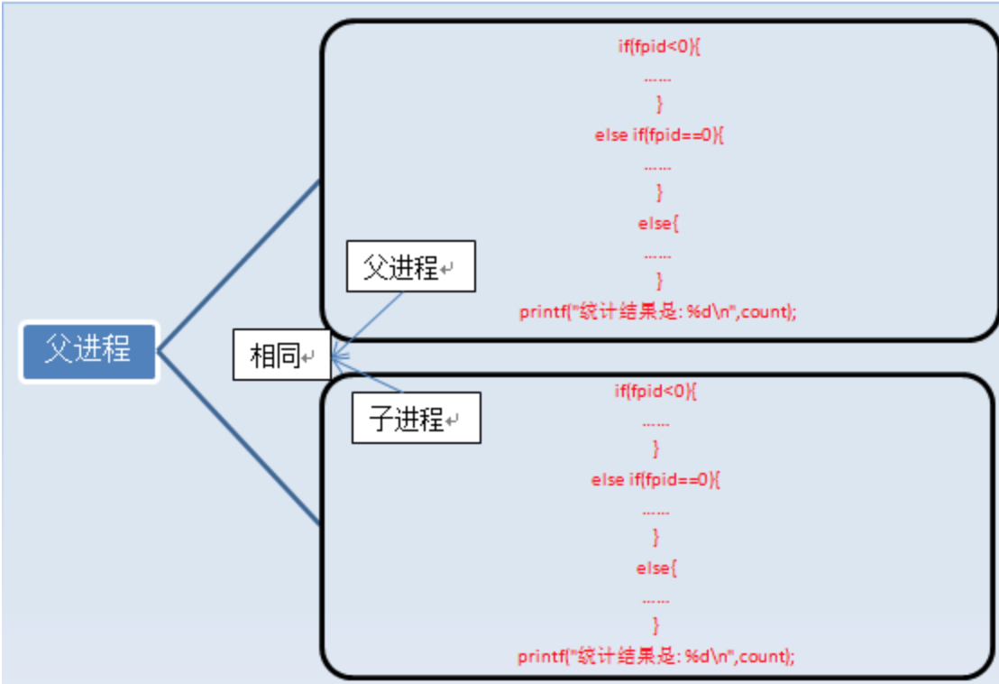
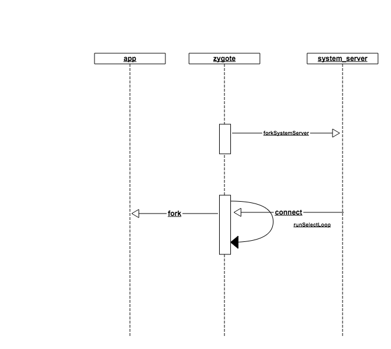

# 参考链接
参考文章:

* Fork介绍: <http://blog.csdn.net/jason314/article/details/5640969>
* 写时拷贝技术: <http://www.cnblogs.com/biyeymyhjob/archive/2012/07/20/2601655.html>
* 深入理解 Android 卷I(很不错): <http://wiki.jikexueyuan.com/project/deep-android-v1/jni.html>

# Fork说明

在linux中，如果想要复制一个当前进程，用的最多的就是fork,中译“分叉”



		#include <unistd.h>
		#include <stdio.h> 
		int main () 
		{ 
			pid_t fpid; //fpid表示fork函数返回的值
			int count=0;
			printf("start fork()/n"); 
			fpid=fork(); 
			if (fpid < 0) 
				printf("error in fork!"); 
			else if (fpid == 0) {
				printf("i am the child process, my process id is %d/n",getpid()); 
				printf("我是爹的儿子/n");//对某些人来说中文看着更直白。
				count++;
			}
			else {
				printf("i am the parent process, my process id is %d/n",getpid()); 
				printf("我是孩子他爹/n");
				count++;
			}
			printf("统计结果是: %d/n",count);
			return 0;
		}
		
		
	start fork()
	i am the child process, my process id is 5574
    我是爹的儿子
    统计结果是: 1
    i am the parent process, my process id is 5573
    我是孩子他爹
    统计结果是: 1
    
这个是参考文章里截取的一部分测试代码，以及进程复制的示意图。可以看到，在执行fork之后的打印，出现了2种分支情况，fork的作用就是这样，从父进程__复制__一个与之基本相同的进程，注意了，这里的复制并不是深复制，我们知道复制可以分为深复制与浅复制。不是深复制，那么它就是浅复制，这个可以第二个参考链接地址。fork用到了linux的写时拷贝技术(copy on write), 简单的说，就是我复制的是一个指向父进程数据的地址，我指向父进程的数据，那么我在拷贝的时候，几乎没有性能消耗(记录一个数字能有多少消耗),当然了，还有虚拟空间的分配。但是，当父/子进程发生数据修改(write时)，就针对写的那部分单独为子进程分配物理内存。


# Android中创建进程的过程


## Step1: Process.start
这个就是在android启动一个应用程序的时候, 为应用程序单独创建应用程序进程的地方，我们继续一步步往下看，启动应用程序，第一个就是activity,所以在创建应用程序的进程时，这里其实是通过ActivityThread创建的进程，稍微简单说明下参数:

* processClass: android.app.ActivityThread,最后会执行它的main函数
* niceName: 应用的进程名，一般为包名
* uid: 应用在系统中的唯一标识
* gid: 应用所在的组id，一般情况下gid=uid
* gids: 应用需要的权限组
* debugFlags: 调试参数
* mountExternal: 是否有外置sd卡
* targetSdkVersion: 目标sdk版本
* seInfo: 安全信息吧，不是很清楚
* abi: 应用使用的系统架构
* instructionSet: 虚拟机参数
* appDataDir: 应用数据文件夹目录
* zygoteArgs: 传给zygote的启动参数


```
	public static final ProcessStartResult start(final String processClass,
                                  final String niceName,
                                  int uid, int gid, int[] gids,
                                  int debugFlags, int mountExternal,
                                  int targetSdkVersion,
                                  String seInfo,
                                  String abi,
                                  String instructionSet,
                                  String appDataDir,
                                  String[] zygoteArgs) {
        try {
            return startViaZygote(processClass, niceName, uid, gid, gids,
                    debugFlags, mountExternal, targetSdkVersion, seInfo,
                    abi, instructionSet, appDataDir, zygoteArgs);
        } catch (ZygoteStartFailedEx ex) {
            Log.e(LOG_TAG,
                    "Starting VM process through Zygote failed");
            throw new RuntimeException(
                    "Starting VM process through Zygote failed", ex);
        }
    }

```

## Step2: Process.startViaZygote
在这一步，有2个函数关注一下,openZygoteSocketIfNeeded和zygoteSendArgsAndGetResult，openZygoteSocketIfNeeded是打开一个socket连接，那连接到哪里，这里涉及到系统启动以及zygote进程的启动与执行,zygoteSendArgsAndGetResult就是通过获取到的连接，传递一些参数到服务端进程，让服务端进程去执行。

	private static ProcessStartResult startViaZygote(final String processClass,
                                  final String niceName,
                                  final int uid, final int gid,
                                  final int[] gids,
                                  int debugFlags, int mountExternal,
                                  int targetSdkVersion,
                                  String seInfo,
                                  String abi,
                                  String instructionSet,
                                  String appDataDir,
                                  String[] extraArgs)
                                  throws ZygoteStartFailedEx {
        synchronized(Process.class) {
            ArrayList<String> argsForZygote = new ArrayList<String>();

            // --runtime-args, --setuid=, --setgid=,
            // and --setgroups= must go first
            argsForZygote.add("--runtime-args");
            argsForZygote.add("--setuid=" + uid);
            argsForZygote.add("--setgid=" + gid);
            // 配置参数
            ...
            return zygoteSendArgsAndGetResult(openZygoteSocketIfNeeded(abi), argsForZygote);
        }
    }
    
    private static ZygoteState openZygoteSocketIfNeeded(String abi) throws ZygoteStartFailedEx {
        if (primaryZygoteState == null || primaryZygoteState.isClosed()) {
            try {
                primaryZygoteState = ZygoteState.connect(ZYGOTE_SOCKET);
            } catch (IOException ioe) {
                throw new ZygoteStartFailedEx("Error connecting to primary zygote", ioe);
            }
        }

        if (primaryZygoteState.matches(abi)) {
            return primaryZygoteState;
        }

        // The primary zygote didn't match. Try the secondary.
        if (secondaryZygoteState == null || secondaryZygoteState.isClosed()) {
            try {
            secondaryZygoteState = ZygoteState.connect(SECONDARY_ZYGOTE_SOCKET);
            } catch (IOException ioe) {
                throw new ZygoteStartFailedEx("Error connecting to secondary zygote", ioe);
            }
        }

        if (secondaryZygoteState.matches(abi)) {
            return secondaryZygoteState;
        }

        throw new ZygoteStartFailedEx("Unsupported zygote ABI: " + abi);
    }
    

    private static ProcessStartResult zygoteSendArgsAndGetResult(
            ZygoteState zygoteState, ArrayList<String> args)
            throws ZygoteStartFailedEx {
        try {
            // Throw early if any of the arguments are malformed. This means we can
            // avoid writing a partial response to the zygote.
            int sz = args.size();
            for (int i = 0; i < sz; i++) {
                if (args.get(i).indexOf('\n') >= 0) {
                    throw new ZygoteStartFailedEx("embedded newlines not allowed");
                }
            }

            /**
             * See com.android.internal.os.ZygoteInit.readArgumentList()
             * Presently the wire format to the zygote process is:
             * a) a count of arguments (argc, in essence)
             * b) a number of newline-separated argument strings equal to count
             *
             * After the zygote process reads these it will write the pid of
             * the child or -1 on failure, followed by boolean to
             * indicate whether a wrapper process was used.
             */
            final BufferedWriter writer = zygoteState.writer;
            final DataInputStream inputStream = zygoteState.inputStream;

            writer.write(Integer.toString(args.size()));
            writer.newLine();

            for (int i = 0; i < sz; i++) {
                String arg = args.get(i);
                writer.write(arg);
                writer.newLine();
            }

            writer.flush();

            // Should there be a timeout on this?
            ProcessStartResult result = new ProcessStartResult();

            // Always read the entire result from the input stream to avoid leaving
            // bytes in the stream for future process starts to accidentally stumble
            // upon.
            result.pid = inputStream.readInt();
            result.usingWrapper = inputStream.readBoolean();

            if (result.pid < 0) {
                throw new ZygoteStartFailedEx("fork() failed");
            }
            return result;
        } catch (IOException ex) {
            zygoteState.close();
            throw new ZygoteStartFailedEx(ex);
        }
    }
    
## Step3: ZygoteInit.main

在android环境下,ps查询一下，可以看到第一个进程是init,这个进程是linux启动之后的第一个进程，它做了很多工作，其中一部分就是启动android中至关重要的zygote进程，zygote之从init进程fork&execv出来的进程，执行了app_main.cpp来替换fork出来的进程。具体可以参考链接资料[深入理解init](http://wiki.jikexueyuan.com/project/deep-android-v1/init.html)，它的其它章节也很好，我也学到了很多。zygote进程的启动是app_main.cpp启动的，只是重新给它命名了。在app_main.cpp中，会创建一个java虚拟机和注册natvie接口，然后调用ZygoteInit的main函数。回到我们的framework层代码。

注册的本地socket相关知识，可以参考链接[本地socket](http://blog.csdn.net/jasonchen_gbd/article/details/45620073)

这里特别说明一下，在这段代码里，用了2种fork的方式创建进程，分别用来创建SystemServer进程与普通应用进程，fork的作用是复制，包括复制代码执行指针，所以fork之后，会在fork的代码之后分叉执行，一般在分支出来的子进程，他们都会抛出一个异常，不错，就是MethodAndArgsCaller，在fork出system_server之后，会抛出一个异常，那父进程zygote继续执行，子进程system_server就去执行MethodAndArgsCaller的run方法，也就是调用SystemServer里的main方法，同理，应用进程的启动也是一样，zygote人如其名，就是一个受精卵，接收到一个socket连接，创建一个进程，子进程抛出一个MethodAndArgsCaller异常执行ActivityThread的main方法，父进程一直在循环等待。

> 示意图:

 


	public static void main(String argv[]) {
        // Mark zygote start. This ensures that thread creation will throw
        // an error.
        ZygoteHooks.startZygoteNoThreadCreation();

        try {
            Trace.traceBegin(Trace.TRACE_TAG_DALVIK, "ZygoteInit");
            RuntimeInit.enableDdms();
            // Start profiling the zygote initialization.
            SamplingProfilerIntegration.start();

            boolean startSystemServer = false;
            String socketName = "zygote";
            String abiList = null;
            // app_main调用这个方法时, start-system-server传递过来了，所以startSystemServer = true
            for (int i = 1; i < argv.length; i++) {
                if ("start-system-server".equals(argv[i])) {
                    startSystemServer = true;
                } else if (argv[i].startsWith(ABI_LIST_ARG)) {
                    abiList = argv[i].substring(ABI_LIST_ARG.length());
                } else if (argv[i].startsWith(SOCKET_NAME_ARG)) {
                    socketName = argv[i].substring(SOCKET_NAME_ARG.length());
                } else {
                    throw new RuntimeException("Unknown command line argument: " + argv[i]);
                }
            }

            if (abiList == null) {
                throw new RuntimeException("No ABI list supplied.");
            }
			// 注册一个本地服务器, 这里就是我们之前说到的连接的服务器，基于AF_UNIX实现的本地socket
			// 通过Os.listen的方法监听，源码是最多连接50个，那这个的意思，应该是anroid系统同时启动的应用进程
			// 理论上最多只有50个同时连接
            registerZygoteSocket(socketName);
            Trace.traceBegin(Trace.TRACE_TAG_DALVIK, "ZygotePreload");
            EventLog.writeEvent(LOG_BOOT_PROGRESS_PRELOAD_START,
                SystemClock.uptimeMillis());
            // 加载framework层的java代码以及资源，这一步想对来说比较耗时
            preload();
            EventLog.writeEvent(LOG_BOOT_PROGRESS_PRELOAD_END,
                SystemClock.uptimeMillis());
            Trace.traceEnd(Trace.TRACE_TAG_DALVIK);

            // Finish profiling the zygote initialization.
            SamplingProfilerIntegration.writeZygoteSnapshot();

            // Do an initial gc to clean up after startup
            Trace.traceBegin(Trace.TRACE_TAG_DALVIK, "PostZygoteInitGC");
            // 主动调用gc
            gcAndFinalize();
            Trace.traceEnd(Trace.TRACE_TAG_DALVIK);

            Trace.traceEnd(Trace.TRACE_TAG_DALVIK);

            // Disable tracing so that forked processes do not inherit stale tracing tags from
            // Zygote.
            Trace.setTracingEnabled(false);

            // Zygote process unmounts root storage spaces.
            Zygote.nativeUnmountStorageOnInit();

            ZygoteHooks.stopZygoteNoThreadCreation();
			
			// zygote进程会执行这步，我们平时经常使用到的service就是这里创建和注册启动的
			// 他会通过fork的方式创建一个名为system_server的进程
			// 执行的是SystemServer里的main方法
            if (startSystemServer) {
                startSystemServer(abiList, socketName);
            }
			
			// 在这里，会监听来自system_server发起的请求, 应用进程的创建就是在这里
			// 子进程(应用进程)就是这里创建的，zygote继续循环，子进程抛出MethodAndArgsCaller异常
			// 然后执行ActivityThread的main函数
            Log.i(TAG, "Accepting command socket connections");
            runSelectLoop(abiList);

            closeServerSocket();
        } catch (MethodAndArgsCaller caller) {
            caller.run();
        } catch (Throwable ex) {
            Log.e(TAG, "Zygote died with exception", ex);
            closeServerSocket();
            throw ex;
        }
    }


## Step4: SytemServer.main & ActivityThread.main

这2个main函数，就是对应了system_server与应用启动的逻辑，对应不同的分析模块，在各自的模块中再详细分析吧。 

